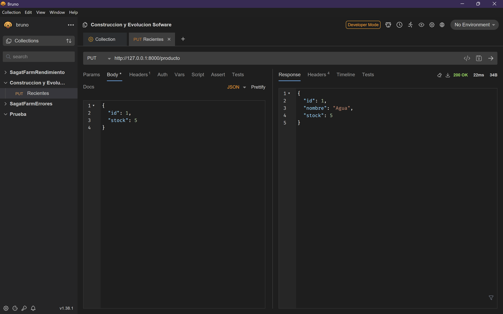
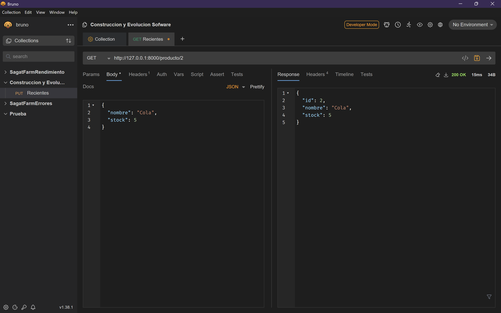

# Prueba II Construcción y Evolución de Software

**Nombre:** Carlos Alejandro Alemán Osorio

## Requisitos Previos

* Python 3.10 o superior
* MySQL Server
* pip (gestor de paquetes de Python)
* Ejecutar pip install -r requirements.txt

## Configuración de Base de Datos

1. Configuración MySQL:
   * Usuario: root
   * Contraseña: (sin contraseña)
   * Host: localhost
   * Puerto: 3306

2. Crear las bases de datos necesarias en MySQL, las tablas se crearán de forma automática gracias a sqlmodel:

   * PruebaII
   * PruebaII_test

## Pruebas realizadas con Bruno (Similar a Postman)

**Actualizar_stock**

**Agregar_producto**

**Consultar_producto**

